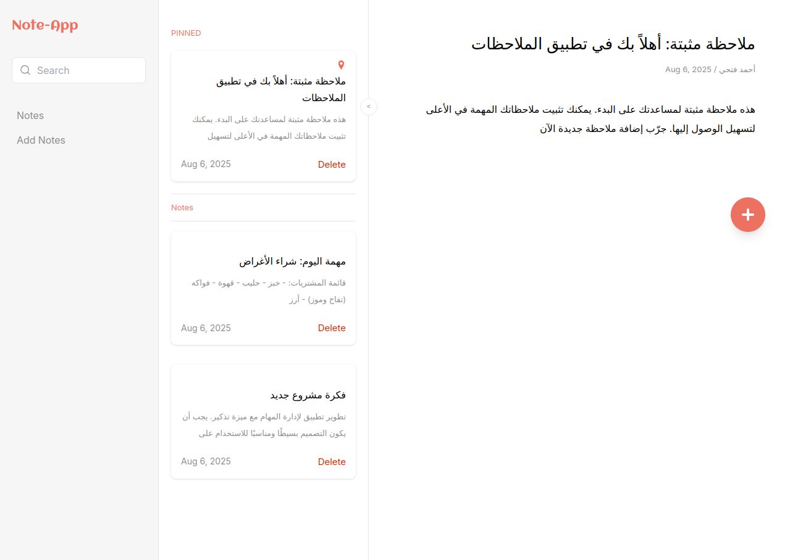
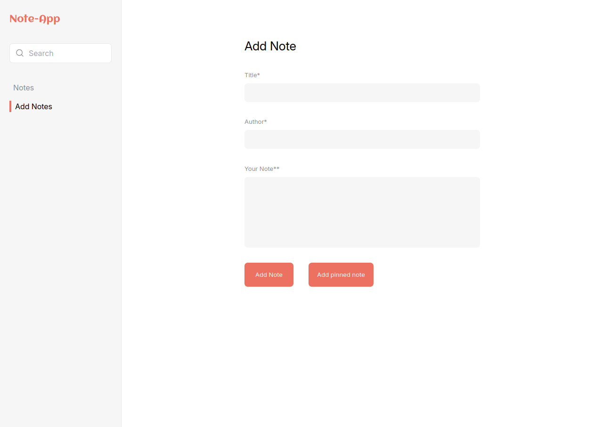
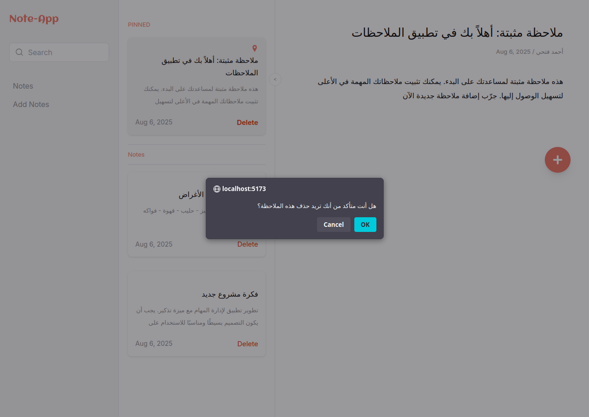
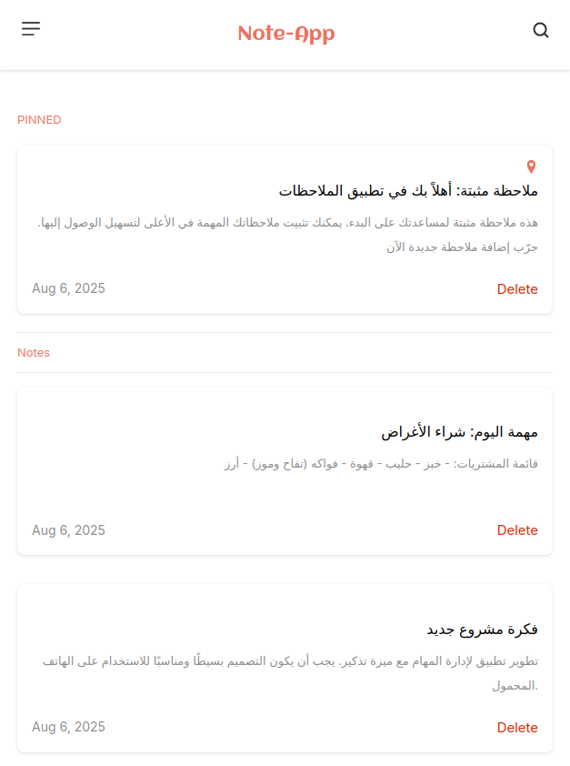
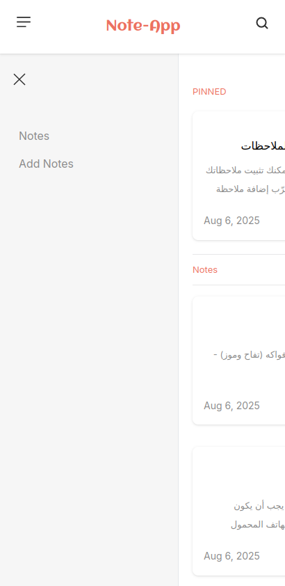
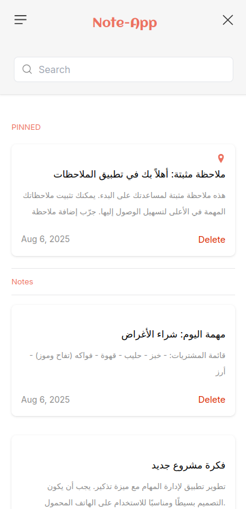

<div dir="rtl">

# 📒 Note-App

## 👀 نظرة عامة

تطبيق **Note-App** هو أداة بسيطة وفعالة لإدارة الملاحظات، تم تطويره باستخدام:

- 💻 HTML / CSS / JavaScript (Vanilla)
- ⚡ Vite كأداة تطوير سريعة
- 🎨 Tailwind CSS لتصميم الواجهة

يتميز بواجهة سريعة الاستجابة وتخزين محلي (LocalStorage) يحفظ الملاحظات حتى بعد إغلاق المتصفح.

---

## ✨ الميزات الرئيسية

- ✅ **إضافة ملاحظات:** إنشاء ملاحظات بعنوان، مؤلف، ومحتوى.
- 📌 **تثبيت الملاحظات:** تثبيت الملاحظات المهمة أعلى القائمة.
- 🔍 **البحث:** فلترة الملاحظات حسب العنوان أو المحتوى.
- 🗑️ **حذف الملاحظات:** إزالة الملاحظات الغير مرغوبة.
- 📱 **واجهة متجاوبة:** تصميم يعمل على الهواتف وأجهزة سطح المكتب.

---

## 🖼️ لقطات الشاشة













---

## 🚀 التشغيل محلياً

> تأكد من أنك قمت بتثبيت [Node.js](https://nodejs.org/) مسبقاً.

ثم في مجلد المشروع:

```bash
npm install
npm run dev
```

</div>
